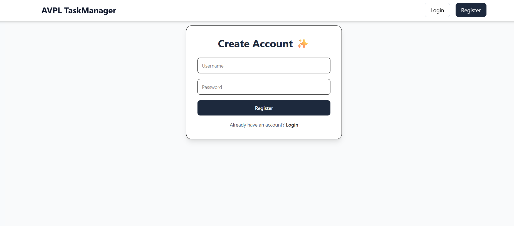
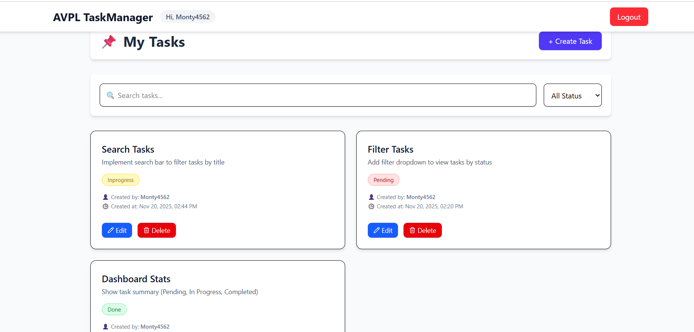
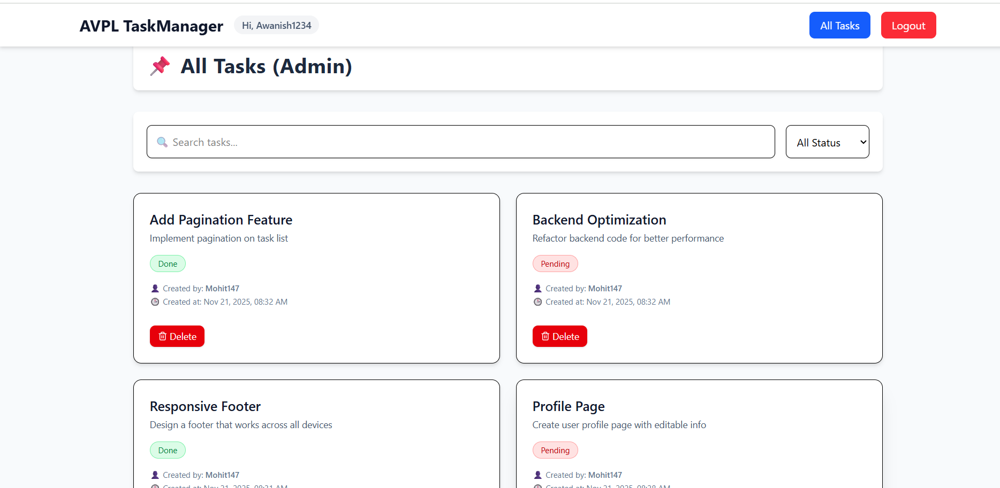
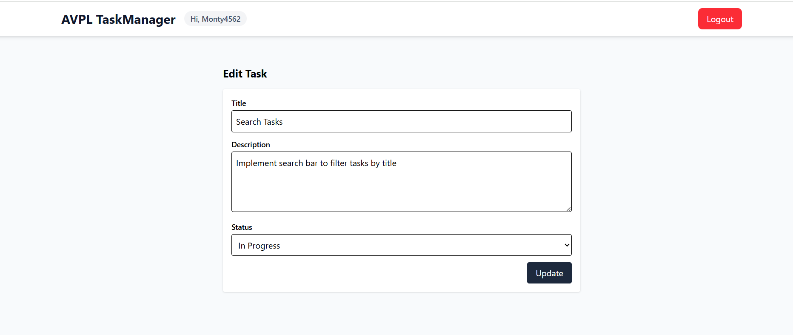
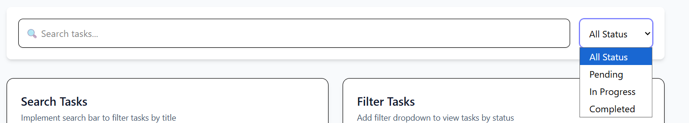
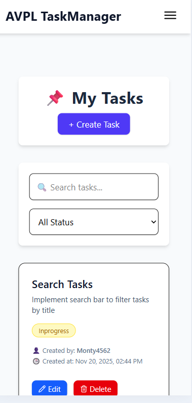

# React + Vite

This template provides a minimal setup to get React working in Vite with HMR and some ESLint rules.

Currently, two official plugins are available:

- [@vitejs/plugin-react](https://github.com/vitejs/vite-plugin-react/blob/main/packages/plugin-react) uses [Babel](https://babeljs.io/) (or [oxc](https://oxc.rs) when used in [rolldown-vite](https://vite.dev/guide/rolldown)) for Fast Refresh
- [@vitejs/plugin-react-swc](https://github.com/vitejs/vite-plugin-react/blob/main/packages/plugin-react-swc) uses [SWC](https://swc.rs/) for Fast Refresh

## React Compiler

The React Compiler is not enabled on this template because of its impact on dev & build performances. To add it, see [this documentation](https://react.dev/learn/react-compiler/installation).

## Expanding the ESLint configuration

If you are developing a production application, we recommend using TypeScript with type-aware lint rules enabled. Check out the [TS template](https://github.com/vitejs/vite/tree/main/packages/create-vite/template-react-ts) for information on how to integrate TypeScript and [`typescript-eslint`](https://typescript-eslint.io) in your project.


# Task Manager 
A full-stack **Task Manager Application** with **Role-Based Access Control**, where:

- Anyone can register and log in  
- Normal users can create, view, edit, and delete **only their own tasks**  
- Admin users can view **all tasks** and delete any task  
- Secure authentication using JWT and password hashing  

---

## 🖼️ Project Preview (Screenshots)

  
  
  
  
  
  
  
  
  


## 🔐 Admin Login Credentials 

```
Username: Awanish1234
Password: Awanish741258963@
```

Use this to test the **Admin Dashboard** (view all tasks, delete any task).

---

## 🚀 Features

### Frontend
- React functional components  
- Login & Register pages  
- JWT stored in LocalStorage  
- Protected Routes (User/Admin)  
- User can create/edit/delete own tasks  
- Admin can view/delete any task  
- Axios-based API service  
- Context API for global Auth state  
- Clean UI with TailwindCSS  
- Responsive design  
- Error handling & redirection  

### Backend
- User Registration & Login using JWT  
- Password hashing using bcrypt  
- Role-Based Access Control (user, admin)  
- Users can create, edit & delete only their own tasks  
- Admin can view & delete any task  
- Validation using JOI  
- Pagination + Search + Filter support  
- Clean industry-level folder structure  
- Environment variables support  
- Error handling & middleware-based authentication  

---


## 📁 Project Folder Structure
```
task-manager-rbac/
│
├── backend/
│   ├── config/
│   │   └── db.js               # Database configuration
│   │
│   ├── controllers/
│   │   ├── authController.js   # Register/Login logic
│   │   └── taskController.js   # Task CRUD operations
│   │
│   ├── middleware/
│   │   ├── auth.js             # JWT authentication middleware
│   │   └── admin.js            # Admin role check
│   │
│   ├── models/
│   │   └── index.js            # User & Task models
│   │
│   ├── routes/
│   │   ├── auth.js             # /api/register, /api/login
│   │   └── tasks.js            # /api/tasks CRUD
│   │
│   ├── .env                    # Environment variables
│   ├── server.js               # App entry point
│   └── package.json
│
└── frontend/
    ├── src/
    │   ├── components/
    │   │   ├── Navbar.jsx
    │   │   ├── TaskCard.jsx
    │   │   └── TaskForm.jsx
    │   │
    │   ├── pages/
    │   │   ├── Login.jsx
    │   │   ├── Register.jsx
    │   │   ├── Dashboard.jsx
    │   │   └── CreateEditTask.jsx
    │   │
    │   ├── context/
    │   │   └── AuthContext.jsx
    │   │
    │   ├── services/
    │   │   └── api.js
    │   │
    │   ├── App.jsx
    │   └── main.jsx
    │
    ├── README.md
    └── .gitignore

    
---

#
---

## 🛠️ Tech Stack

- **Frontend:** React.js, React Router, Context API, Axios, TailwindCSS, LocalStorage (JWT)  
- **Backend:** Node.js, Express.js, SQLite, JWT Authentication, bcryptjs, Joi Validation  

---

## 🚀 Getting Started

### Backend
```bash
cd backend
npm install
node server.js

## Frontend
```bash
cd frontend
npm install
npm run dev

## 🔒 Authentication Flow

1. User logs in → receives JWT
2. JWT stored in LocalStorage
3. Token auto-included in all API requests
4. Protected Routes block access if not logged in
5. Auto-redirect based on role (`user` → Dashboard, `admin` → Admin Panel)


## 📌 API Documentation

### Auth Routes
| Method | Endpoint      | Description |
|--------|--------------|-------------|
| POST   | /api/register | Register new user |
| POST   | /api/login    | Login user and return JWT token |

---

### Task Routes
| Method | Endpoint       | Description |
|--------|----------------|-------------|
| POST   | /api/tasks     | Create a task (user only) |
| GET    | /api/tasks     | User = own tasks, Admin = all tasks |
| GET    | /api/tasks/:id | Get task by ID |
| PUT    | /api/tasks/:id | Edit own task |
| DELETE | /api/tasks/:id | Delete own task (admin → delete any) |

---

## 🔐 Role-Based Access

| Role  | Permissions |
|--------|-------------|
| **User**  | Create/Edit/Delete **only own tasks** |
| **Admin** | View **all tasks**, delete any task |

---

## 🤝 Developed By  
**Awanish Kumar Singh**

---

